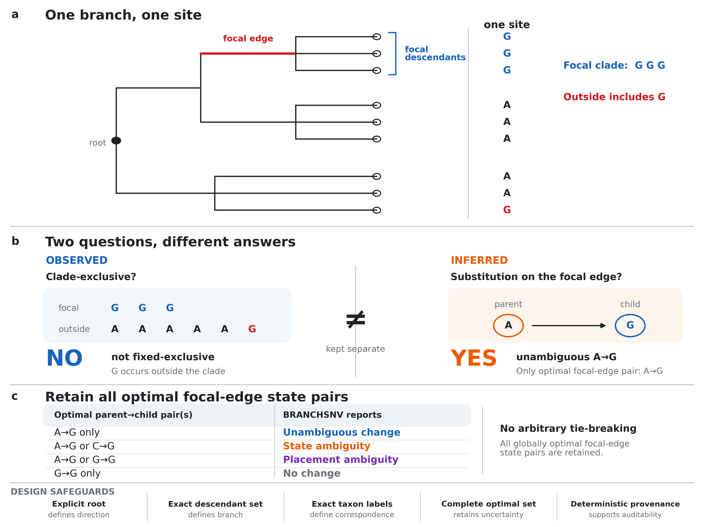

# Figure 1 — conceptual design of BRANCHSNV

This directory contains the final Figure 1 artwork, the exact Python/Matplotlib script used to generate it, and documentation of the current figure generator.

The figure is intentionally parsimonious: one branch, one site, two distinct analytical questions, complete retention of optimal focal-edge state pairs, and the minimum set of safeguards needed to make the branch-level result auditable.

## Final figure



## Figure legend

**Figure 1. BRANCHSNV separates clade exclusivity from focal-edge substitution.** **a,** A single nucleotide site is evaluated on an explicitly rooted phylogeny with a focal edge defined by its exact sampled descendant set. All focal descendants carry G, while G also occurs in a sampled taxon outside the focal clade. **b,** BRANCHSNV evaluates clade exclusivity and focal-edge substitution independently. Because G occurs outside the focal clade, the site is not fixed-exclusive. Under unordered equal-cost Sankoff parsimony, every globally optimal reconstruction supports A→G on the focal edge, so the focal-edge substitution is unambiguous. **c,** BRANCHSNV retains every parent–child nucleotide-state pair attainable on the focal edge across globally optimal reconstructions. A single changing pair is reported as an unambiguous change; multiple changing pairs indicate state ambiguity; a mixture of changing and non-changing pairs indicates placement ambiguity; and exclusively non-changing pairs indicate no change. The safeguards shown below the panels make rooting, branch identity, taxon correspondence, optimal-solution retention and analysis provenance explicit.

## Directory contents

| File | Purpose | SHA-256 |
|---|---|---|
| `Figure_1.pdf` | Vector PDF suitable for manuscript submission and production. | `69f9fb6af44741e2759ced93198a7bce23beeb80d1fa271106bac8ace6cd3141` |
| `Figure_1_editable.svg` | Editable vector source. | `406ae542d72b6703ebe065f0fc4e1ba1a282b2a9188ce30cfdc82e458b31f2a8` |
| `Figure_1_preview_600dpi.png` | GitHub/README preview. | `ce8a152ae97350c48f8303e25e4148cd7f51b158ec480aecefe1b402857e8816` |
| `Figure_1_1000dpi.tiff` | 1000-dpi LZW-compressed TIFF generated directly by the plotting script. | `ea7b5692f5d195959bfb1c69d9e5b48c085734eb10806c32b293f1f9aaf20b75` |
| `Figure_1_1000dpi_RGB.tiff` | RGB-flattened 1000-dpi LZW TIFF for production workflows requiring RGB artwork. | `2b7604633767dec50bc065d5122c0183c6b9c73ecf61f12caf4ed2ab59f04b0b` |
| `make_figure_1.py` | Exact script used to generate the final figure files in this directory. | — |
| `CODE_WALKTHROUGH.md` | Plain-English explanation of the current figure generator. | — |
| `requirements.txt` | Python package versions used for the locked render and production conversion. | — |

## Reproducing the figure

The revised locked render and RGB production conversion used:

```text
Python 3.10.14
Matplotlib 3.10.8
Pillow 12.2.0
```

From this directory, run:

```bash
python make_figure_1.py
```

The script writes the PDF, SVG, PNG, and RGBA TIFF outputs into the same directory. The separate RGB production TIFF is generated from the RGBA TIFF by flattening transparency onto a white background with Pillow.

## Figure specifications

The final artwork is:

- 180 × 135 mm;
- a single multi-panel figure with lower-case bold panel labels `a`, `b` and `c`;
- predominantly vector line art;
- approximately 6–10 pt text at final size;
- consistent publication-scale line weights;
- restrained semantic colour encoding on a white background;
- supplied as vector PDF and editable SVG;
- supplied as a 1000-dpi LZW-compressed TIFF;
- supplied as a separate 600-dpi PNG for GitHub preview;
- free of numbered literature references inside the artwork.

The figure title and legend are kept outside the artwork so that the image file contains only the figure itself.

### Font note

The exact script uses **Arimo** because Microsoft Arial was not available in the environment used for the locked render. Arimo is metrically compatible with Arial, and the PDF/SVG retain editable text. If a production workflow requires Arial, replace Arimo with Arial in the editable vector artwork or script, then verify that no labels shift or overlap before exporting the final production files.

## Scientific logic of the illustrative example

Panel A uses a deliberately simple but internally consistent topology and nucleotide pattern.

The three focal descendants are:

```text
G G G
```

The six sampled taxa outside the focal clade are:

```text
A A A A A G
```

G is therefore **not fixed-exclusive**, because G is also present outside the focal clade.

For the illustrated rooted topology, unordered equal-cost Sankoff parsimony has a complete optimal focal-edge parent-child pair set of:

```text
A→G only
```

The focal-edge substitution is therefore unambiguous even though the derived G state is not clade-exclusive. This is the conceptual distinction BRANCHSNV is designed to preserve.

## Editing policy

The files in this directory represent the locked scientific content of Figure 1.

If the figure is edited:

1. regenerate the exported files from `make_figure_1.py` where possible;
2. confirm that the topology and nucleotide-state example are unchanged unless the scientific example is intentionally revised;
3. independently re-check the focal-edge parsimony result if the topology or site states are changed;
4. inspect the figure at final print size for text collisions, clipped labels, and alignment;
5. update the file checksums in this README.
