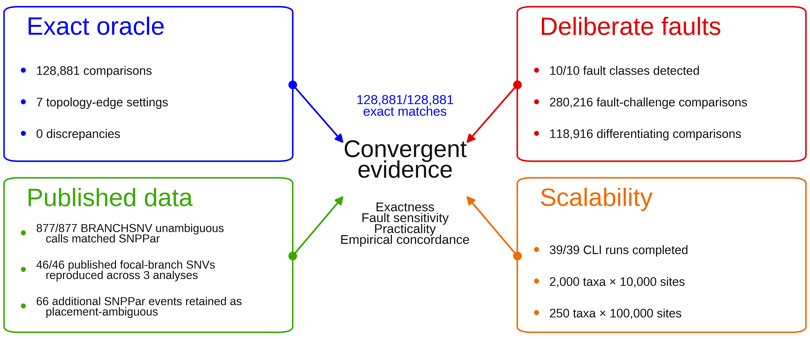

# Figure 2 - convergent validation evidence for BRANCHSNV

This directory contains the manuscript Figure 2 artwork and the exact Python/Matplotlib code used to render it from the committed validation summaries.

## Final figure



## Data provenance

The numerical claims are read directly from:

- `results/01_exact_oracle/summary.json`
- `results/02_deliberate_faults/summary.json`
- `results/03_published_datasets/summary.json`
- `results/04_scalability/summary.json`
- `results/05_published_focal_branches/summary.json`

The figure therefore reflects the same machine-readable results checked by `verify_publication_snapshot.py`. No validation count is manually entered into the plotting code.

## Figure files

| File | Purpose | SHA-256 |
|---|---|---|
| `Figure_2.pdf` | Vector production/submission figure. | `a7e99653f2e2365665ba35bb064d0b522ff3b96924d7116cc138c3161fec344a` |
| `Figure_2_editable.svg` | Editable vector source. | `429a7e8d68fff39b0f68ccd112eeb0148dcd84744e8b4b6af886e70e760ccc18` |
| `Figure_2_preview_600dpi.png` | README/inspection preview. | `445c9c75912889df3012cf7ae6126e7f904c9237c1dbfdcc8464b292004b0b52` |
| `Figure_2_1000dpi.tiff` | 1000-dpi LZW TIFF. | `23fa81b5f23cb9f29d822c9c0642f2e2538ae18e13c3feb252313fda6957456a` |
| `Figure_2_1000dpi_RGB.tiff` | Explicit RGB 1000-dpi LZW TIFF. | `0286033016c689b1be1a2d14ace7291a7b28549039ac5c600c63b2a32a40e0ee` |

## Reproducing the figure

The locked render used Python 3.13, Matplotlib 3.10.8, Pillow 12.3.0, and Arimo regular/bold.

From the repository root:

```bash
python manuscript/figure_2/make_figure_2.py
```

The script writes all five artwork files beside itself and updates this README's artwork checksums. `CODE_WALKTHROUGH.md` is maintained separately and is deliberately not overwritten during rerendering.

## Interpretation

The four boxes represent complementary validation evidence rather than four estimates of the same property. The oracle tests exact implementation of the defined reconstruction problem; deliberate faults test sensitivity to specified implementation errors; published-data analyses test concordance and reproduction on independent empirical examples; and scalability tests establish practical end-to-end behavior over the measured input ranges.

### Font note

The locked render uses **Arimo**, an Arial-compatible metric substitute. The script fails if Arimo regular or bold is unavailable rather than silently substituting another font. Exact output-file bytes can still vary across platforms with the font/FreeType rendering stack; the committed artwork hashes identify the publication render. The SVG retains editable text.
