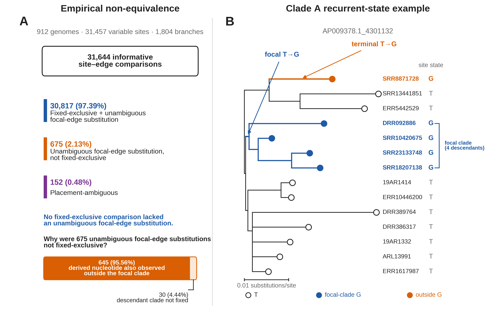

# Figure 3 - clade exclusivity and focal-edge substitution were not equivalent in empirical phylogenies

This directory contains the final Figure 3 artwork and the exact Python/Matplotlib code used to render it.

## Final figure

## Data provenance

Panel A is generated directly from:

- `results/06_empirical_cross_classification/dataset_summary.tsv`
- `results/06_empirical_cross_classification/informative_events.tsv`

Panel B is generated directly from:

- `inputs/empirical/clade_a_tree.nwk`
- `inputs/empirical/clade_a_alignment.nex`

The displayed tree is a pruned **phylogram** from the supplied Clade A tree. Horizontal branch lengths are retained from the Newick input. No schematic or invented topology is used.

## Figure files

| File | Purpose | SHA-256 |
|---|---|---|
| `Figure_3.pdf` | Vector production/submission figure. | `0238bad35ee01112f29ec851fb6fce497719185cf61b9572b4db38ac267d54c9` |
| `Figure_3_editable.svg` | Editable vector source. | `cdef0f2abf50b5de0ca5b92e4d7fdce93a063536c25b3f91807d960d808eed2b` |
| `Figure_3_preview_600dpi.png` | README/inspection preview. | `0fc1ff4911c9ce694145a8e73c543757df30d733391c0dce1f678e5215858ba8` |
| `Figure_3_1000dpi.tiff` | 1000-dpi LZW line-art TIFF. | `5e0bf2b581b7a6f3af2ca6fa808fd032d14a805a2e557e25eaaf94d75688a2b3` |
| `Figure_3_1000dpi_RGB.tiff` | Explicit RGB 1000-dpi LZW TIFF. | `d88bad3428bd0d49bba9b4ae5beae56135edec60ad2df65b4cab224c431d9bb4` |

## Artwork preparation choices

- final artwork size: **6.5 × 4.4 in**;
- figure title and legend are not embedded in the artwork;
- capital panel labels A and B;
- text is approximately 6–8 pt at final print size;
- line weights are approximately 0.5–1.25 pt;
- vector PDF and editable SVG supplied;
- 1000-dpi LZW TIFF supplied for line-art production;
- RGB raster export supplied;
- Figure 1 color semantics retained: blue, orange, purple, and neutral grayscale.

### Font note

Arial is requested first in the Matplotlib font stack. Arial is not installed in the automated rendering environment, so the locked render uses **Arimo**, an Arial-compatible metric substitute. The SVG keeps text editable so the font can be substituted later if required.
