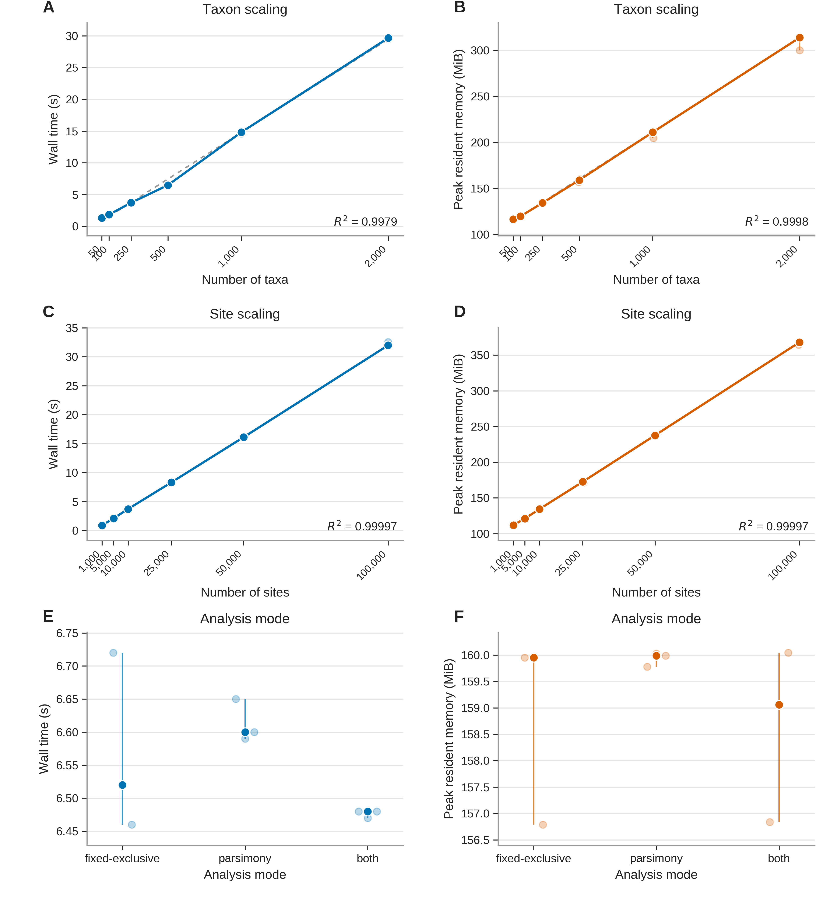

# Figure 4 - end-to-end BRANCHSNV scalability

This directory contains the final Figure 4 artwork and the repository-portable Python/Matplotlib script used to generate it from the committed BRANCHSNV scalability measurements.

The benchmark experiment itself remains under `experiments/04_scalability/`. This manuscript directory does **not** duplicate or rerun the experiment: `make_figure_4.py` reads the committed run-level measurements from `results/04_scalability/raw_runs.tsv`, checks that the expected three measured runs are present for every plotted configuration, calculates the descriptive summaries and linear fits, and writes the publication artwork.

## Final figure



## Figure legend

**Figure 4. End-to-end BRANCHSNV runtime and peak-memory scaling with taxon number, alignment length, and analysis mode.** **(A)** Wall time and **(B)** peak resident memory as taxon number increased at a constant alignment length of 10,000 sites. **(C)** Wall time and **(D)** peak resident memory as alignment length increased at a constant 250 taxa. **(E)** Wall time and **(F)** peak resident memory for fixed-exclusive, parsimony, and both modes using the same 500-taxon x 10,000-site matrix. Small semi-transparent points show the three individual measured command-line invocations for each configuration; larger filled points show their medians, and vertical lines span the observed minima and maxima. Solid colored lines in panels A-D connect the medians, and grey dashed lines show descriptive ordinary least-squares linear fits across the tested ranges. Blue denotes wall time and orange denotes peak resident memory. Each measurement included input parsing, taxon validation, branch selection, analysis, and generation of the results, membership, and provenance-report files.

## Directory contents

| File | Purpose | SHA-256 |
|---|---|---|
| `Figure_4.pdf` | Vector PDF suitable for manuscript submission and production. | `eea2905ad3dff84674dc1718195cfd62c10bc5f36286537e912a84863f579066` |
| `Figure_4_editable.svg` | Editable vector source. | `3ac45fde1bee0677126a4b518046141db8cc0e79d0f717fa7f96212d44c4fd16` |
| `Figure_4_preview_600dpi.png` | GitHub/README preview. | `7c10c2e86e839c8c6cd83888aa7503a4347c0f688439a5764e4118dce5cb2b14` |
| `Figure_4_1000dpi.tiff` | 1000-dpi LZW-compressed TIFF generated directly by Matplotlib. | `98a29d3b4af141c77590876d5c3d15c6d497b4de99820d12034e7c2b3bc35725` |
| `Figure_4_1000dpi_RGB.tiff` | Explicit RGB-flattened 1000-dpi LZW TIFF for production workflows requiring RGB artwork. | `79769021d792a60d328f13eeef8deba17ed890a2a5231e4410a5ed5c0e721fbd` |
| `make_figure_4.py` | Exact repository-portable script used to generate the final figure files. | - |
| `CODE_WALKTHROUGH.md` | Plain-English explanation of the data checks, calculations, plotting, and export code. | - |
| `DIRECTORY_TREE.txt` | Shows where the figure package sits relative to its experimental inputs. | - |
| `requirements.txt` | Python packages used for the locked render. | - |

## Reproducing the figure

The locked render used:

```text
Python 3.13.5
Matplotlib 3.10.8
Pillow 12.3.0
```

From the repository root:

```bash
python manuscript/figure_4/make_figure_4.py
```

or from this directory:

```bash
python make_figure_4.py
```

The script expects:

```text
results/04_scalability/raw_runs.tsv
```

and writes all five final artwork files beside itself.

## Scientific provenance

The intended data flow is:

```text
experiments/04_scalability/
    generate_inputs.py
    run.py
    summarize_models.py
    plot_results.py
            |
            v
results/04_scalability/
    raw_runs.tsv
    benchmark_summary.tsv
    scaling_models.tsv
    summary.json
    run_metadata.json
            |
            v
manuscript/figure_4/
    make_figure_4.py
            |
            v
    Figure_4.pdf
    Figure_4_editable.svg
    Figure_4_preview_600dpi.png
    Figure_4_1000dpi.tiff
    Figure_4_1000dpi_RGB.tiff
```

`make_figure_4.py` uses `raw_runs.tsv` as the source of truth so the individual measured invocations shown in the figure are directly traceable to the committed benchmark output. It recalculates medians, observed minima/maxima, and the four descriptive linear fits from those run-level values rather than embedding summary numbers in the plotting code.

The expected benchmark design is:

- taxon scaling: 50, 100, 250, 500, 1,000, and 2,000 taxa at 10,000 sites, `mode=both`;
- site scaling: 1,000, 5,000, 10,000, 25,000, 50,000, and 100,000 sites at 250 taxa, `mode=both`;
- analysis-mode comparison: `fixed-exclusive`, `parsimony`, and `both` at 500 taxa x 10,000 sites;
- three measured fresh command-line runs per configuration after one unmeasured warm-up.

The script fails rather than silently plotting a partial configuration if any expected configuration does not contain exactly three measured runs.

## Figure specifications

The final artwork is:

- 6.50 x 7.10 inches;
- a single six-panel figure with capital panel labels A-F;
- predominantly vector line art;
- approximately 6-8 pt text at the intended print size;
- supplied as vector PDF and editable SVG;
- supplied as a 600-dpi PNG for GitHub preview;
- supplied as 1000-dpi LZW-compressed TIFF and explicit RGB TIFF;
- free of an embedded manuscript figure title or legend;
- free of numbered literature references inside the artwork.

The blue/orange encoding is functional rather than decorative: blue is wall time and orange is peak resident memory. The same encoding is used consistently across taxon scaling, site scaling, and mode comparison.

### Font note

The locked render uses **Arimo**, matching the existing Figure 1 package, because Microsoft Arial was not available in the rendering environment. The SVG and PDF retain editable text. If final production requires Arial, change the font in the editable vector artwork or plotting script and verify that labels have not shifted or collided before re-exporting.

## Editing policy

If the figure is edited:

1. retain `results/04_scalability/raw_runs.tsv` as the source of the plotted benchmark values;
2. do not replace the three measured run points with synthetic jittered values - only their horizontal display positions are jittered;
3. re-check that all 13 unique configuration-mode combinations contain three runs;
4. confirm that the four calculated R-squared values still match the committed benchmark summaries;
5. inspect the final PDF and raster exports at final print size;
6. update the SHA-256 values in this README after re-exporting.
